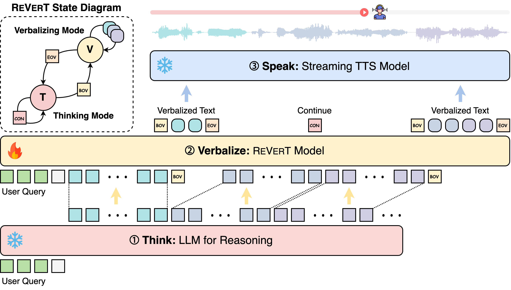

<div align="center">
    <h1 align="center">Think, Verbalize, then Speak</h1>
</div>

<div align="center">

### Bridging Complex Thoughts and Comprehensible Speech

[Sang Hoon Woo*](https://scholar.google.com/citations?user=kt3_CnoAAAAJ&hl=en), [Sehun Lee*](https://yhytoto12.github.io), [Kang-wook Kim](https://kwkim.me/), [Gunhee Kim](https://vision.snu.ac.kr/gunhee)

</div>

<div align="center">

[ [🌐 Project Page](https://yhytoto12.github.io/TVS-ReVerT) ] [ [📄 Paper](https://arxiv.org/abs/2509.16028) ] [ [🤗 Datasets](#-datasets) ] [ [🤖️ Models](#️-scripts) ]

</div>

## 💥 News

- `2025.09.22` 🚀 We released our paper on [arXiv](https://arxiv.org/abs/2509.16028).
- `2025.09.19` 🔥 We released the training code, datasets, models, and interactive demo.
- `2025.08.21` 🎉 Our paper got accepted to **EMNLP 2025**!

## 👀 Introduction

Recent spoken dialogue systems leverage large language models (LLMs) for advanced reasoning. However, a mismatch between optimal textual and verbal delivery limits their effectiveness in spoken communication. While some approaches adapt LLMs for speech-friendly outputs, their impact on reasoning remains underexplored. We propose **Think-Verbalize-Speak**, a framework that separates reasoning from spoken delivery to preserve the full reasoning capacity of LLMs. Central to our method is verbalizing, an intermediate step that translates thoughts into natural, speech-ready text. We also introduce **ReVerT**, a latency-efficient verbalizer based on incremental and asynchronous summarization.

<p align="center">
     <br>
</p>

## 🛠️ Installation
- Python >= 3.10
- PyTorch >= 2.6
```bash
git clone https://github.com/yhytoto12/TVS-ReVerT.git
cd TVS-ReVerT
conda create -n tvs python=3.10
conda activate tvs
pip install --extra-index-url https://download.pytorch.org/whl/cu124 torch==2.6 transformers vllm==0.8.5 openai

# Use flash attention for faster training and inference (optional)
pip install -U flash-attn --no-build-isolation

# For deepspeed training (optional)
pip install deepspeed
```

## 🤖️ Interactive Demo
You can try our interactive demo by running one of the following commands:

* Using OpenAI models as the Think model:
```bash
python demo.py --think_model <openai_model_name> --verbalizer_model yhytoto12/revert-Qwen2.5-3B --use_openai_think
```

* Using local models as the Think model:
```bash
# vLLM backend
python -m vllm.entrypoints.openai.api_server --model Qwen/Qwen2.5-7B-Instruct --host 0.0.0.0 --port 8000 --gpu_memory_utilization 0.5
# Run the demo in a separate terminal
python demo.py --think_model Qwen/Qwen2.5-7B-Instruct --verbalizer_model yhytoto12/revert-Qwen2.5-3B --vllm_url http://localhost:8000/v1
```

## 🚀 Training
### 📊 Datasets

Our training datasets are available on Hugging Face:

- [🤗 **GSM8k**](https://huggingface.co/datasets/yhytoto12/tvs-gsm8k)
- [🤗 **2WikiMultihopQA**](https://huggingface.co/datasets/yhytoto12/tvs-2wikimultihopqa)

These datasets contain thought-verbalization pairs that can be used for training verbalizers to transform complex reasoning into natural, speech-ready outputs.

### 🛠️ Scripts
We provide scripts for training the models, including one baseline (SFF) and two verbalizers discussed in this paper. The default base model is `Qwen/Qwen2.5-3B-Instruct`, but you can change it by modifying the `model_name_or_path` variable in the training scripts.

* Training **Speech-Friendly Finetuning (SFF)** Model
    ```bash
    bash scripts/train_sff.sh -g <num_gpus>
    ```

* Training **TVS(SEQ)** Model
    ```bash
    bash scripts/train_tvs_seq.sh -g <num_gpus>
    ```

* Training **TVS(ReVerT)** Model
    ```bash
    bash scripts/train_tvs_revert.sh -g <num_gpus>
    ```

    You can find the trained ReVerT models on Hugging Face:
    - [🤗 **Qwen2.5-3B** ](https://huggingface.co/yhytoto12/revert-Qwen2.5-3B)
    - [🤗 **Qwen2.5-0.5B** ](https://huggingface.co/yhytoto12/revert-Qwen2.5-0.5B)

## 🖊️ Citation
If you find our project useful for your research and applications, please kindly cite using this BibTeX:
```bibtex
@inproceedings{tvs2025@woolee,
  title={Think, Verbalize, then Speak: Bridging Complex Thoughts and Comprehensible Speech},
  author={Sang Hoon Woo, Sehun Lee, Kang-wook Kim, Gunhee Kim},
  booktitle={Proceedings of the EMNLP 2025},
  year={2025}
}
```
